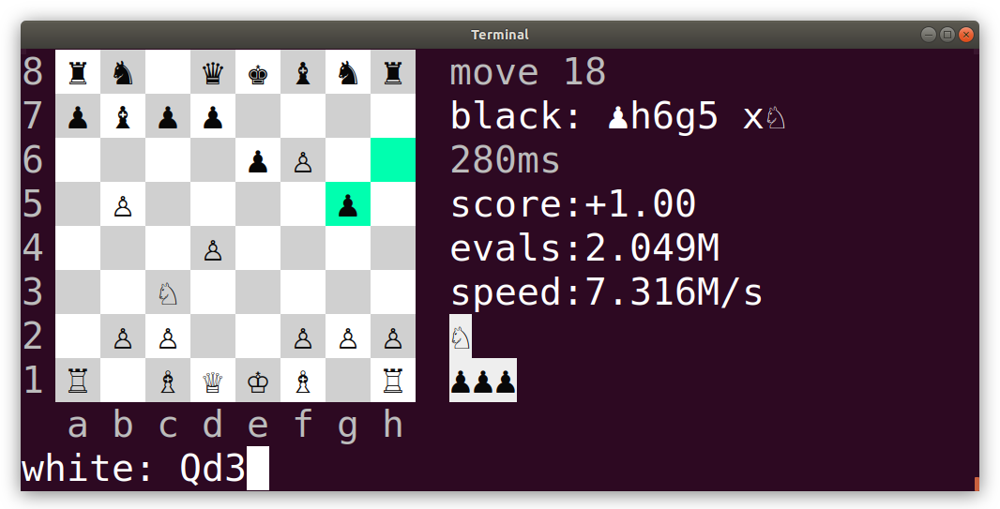

#Chess

A chess engine with command line interface.




## Install

```
go get github.com/barnex/chess/cmd/chess-cli
```

## Play

```
chess-cli
```

`chess-cli` requires a 256-color, UTF-8 capable terminal emulator (like most Linux terminals). Terminal font must support unicode chess symbols (like most fonts, including `Monospace`).

Moves are typed in algebraic notation:

```
e2e4  Move from e2 to e4
e4    Short for pawn to e4, if unambiguous
Nc3   Short for Knight to c3, if unambiguous
```

Opponents are selected with command-line flag `-e`:

```
chess-cli -e picard
```

List of opponents:

## tarr
Greedy tactics, immediately captures the most valuable piece possible. Calculates only one move ahead. Trivial to beat.

## riker
Calculates 2 moves ahead (negamax algorithm), i.e. considers all you possible counter-moves but nothing further than that. Can be beaten by my 6-year old.

## worf
Optimized version of riker, calculates 3 moves ahead. Still only has tactics, no long-term strategy.

## troi
Adds strategy to worf's tactics. Tries to protect pieces, keep them mobile, and tries to pin her opponent's pieces.

## picard
Like troi, but employs alpha-beta pruning instead of simple minimax, allowing to calculate 4 moves ahead. Strategy is a bit more optimized too.

## crusher
Has far better strategy, tries to control the center of the board. First calculates 4 moves ahead, then deepens to 6 moves for the most promising candidates.
